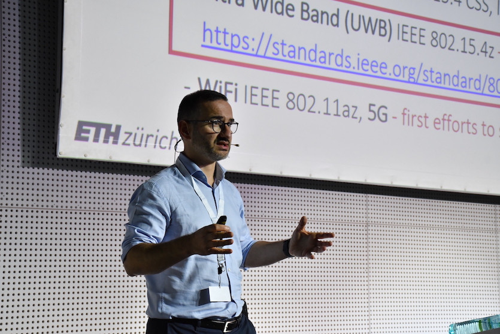

  
  
  
  

    <h1>Srdjan Capkun</h1>
    
<strong>Professor</strong> 
    <a href="https://inf.ethz.ch/">Department of Computer Science, ETH Zurich</a> 
    Zürich, Switzerland

    
    
Srdjan Capkun (Srđan Čapkun) is a Full Professor in the Department of Computer Science at ETH Zurich, where he also serves as Associate Vice President for Digital Transformation and Governance and Chair of the Zurich Information Security and Privacy Center (ZISC). Originally from Split, Croatia, he received his Dipl. Ing. degree in Electrical Engineering / Computer Science from the University of Split in 1998, and his Ph.D. in Communication Systems from EPFL in 2004. His research focuses on system and network security, with a particular emphasis on wireless security (specifically secure positioning), trusted computing, and distributed ledgers. In 2016, he was awarded an ERC Consolidator Grant to secure positioning in wireless networks. He is a Fellow of the ACM and of the IEEE. Alongside his academic research, his work has successfully translated into the industry sector; he is a co-founder of several security-focused companies, including Soverli (building sovereign smartphone architectures), Futurae, and 3db Access (a UWB secure ranging company acquired by Infineon).

    
<strong>Email:</strong> srdjan.capkun@inf.ethz.ch

  

* [How to pronounce [Srđan](https://forvo.com/word/sr%C4%91an/) (Srdjan)]

---

## Research
I lead the [**System Security Group**](https://syssec.ethz.ch/) at ETH Zurich. I am lucky to have been able to work with some exceptional [PhD students and postdoctoral researchers](https://syssec.ethz.ch/people/).

---

## Selected Recent Publications
*[Complete list of publications and pdfs](https://syssec.ethz.ch/publications/) 

* Daniele Coppola, Arslan Mumtaz, Giovanni Camurati, Harshad Sathaye, Mridula Singh, Srdjan Capkun
LEO-Range: Physical Layer Design for Secure Ranging with Low Earth Orbiting Satellites
in Usenix Security 2025

* Ivan Puddu, Moritz Schneider, Daniele Lain, Stefano Boschetto, Srdjan Capkun
On (the Lack of) Code Confidentiality in Trusted Execution Environments Authors: in IEEE S&P 2024 [PDF] (preprint)

* Daniele Coppola, Giovanni Camurati, Claudio Anliker, Xenia Hofmeier, Patrick Schaller, David Basin, Srdjan Capkun
PURE: Payments with UWB RElay-protection,
in Usenix Security 2024 [PDF]

* Claudio Anliker, Giovanni Camurati, Srdjan Čapkun
Time for Change: How Clocks Break UWB Secure Ranging
https://arxiv.org/abs/2305.09433, in Usenix Security 2023

* Daniele Lain, Kari Kostiainen, Srdjan Čapkun
Phishing in Organizations: Findings from a Large-Scale and Long-Term Study
in IEEE Symposium on Security and Privacy (S&P), 2022
[BIB | PDF | DOI]

* Friederike Groschupp, Mark Kuhne, Moritz Schneider, Ivan Puddu, Shweta Shinde, Srdjan Capkun
It’s TEEtime: Bringing User Sovereignty to Smartphones
https://arxiv.org/abs/2211.05206, 2022

* Martin Kotuliak, Simon Erni, Patrick Leu, Marc Röschlin, Srdjan Čapkun
LTrack: Stealthy Tracking of Mobile Phones in LTE
in USENIX Security 2022 [PDF]

* Karl Wüst, Kari Kostiainen, Noah Delius, Srdjan Capkun
Platypus: A Central Bank Digital Currency with Unlinkable Transactions and Privacy Preserving Regulation, In ACM Conference on Computer and Communications Security (CCS), 2022 [PDF]

* Patrick Leu, Giovanni Camurati*, Alexander Heinrich, Marc Roeschlin, Claudio Anliker, Matthias Hollick, Srdjan Capkun, and Jiska Classen
Ghost Peak: Practical Distance Reduction Attacks Against HRP UWB Ranging
in USENIX Security 2022
https://securepositioning.com/ghost-​peak/  

* Friederike Groschupp, Moritz Schneider, Ivan Puddu, Shweta Shinde, Srdjan Čapkun
Sovereign Smartphone: To Enjoy Freedom We Have to Control Our Phones
in Arxiv e-​print (arXiv:2102.02743), 2021 [PDF]

* Ivan Puddu, Moritz Schneider, Miro Haller, Srdjan Čapkun
Frontal Attack: Leaking Control-​Flow in SGX via the CPU Frontend
in USENIX Security 2021 [PDF]

* Enis Ulqinaku and Hala Assal and AbdelRahman Abdou and Sonia Chiasson and Srdjan Čapkun
Is Real-​time Phishing Eliminated with FIDO? Social Engineering Downgrade Attacks against FIDO Protocols, in Usenix Security 2021 [PDF]

* Decentralized Privacy-​Preserving Proximity Tracing. 
Carmela Troncoso, Mathias Payer, Jean-​Pierre Hubaux, Marcel Salathé, James Larus, Edouard Bugnion, Wouter Lueks, Theresa Stadler, Apostolos Pyrgelis, Daniele Antonioli, Ludovic Barman, Sylvain Chatel, Kenneth Paterson, Srdjan Capkun, David Basin, Jan Beutel, Dennis Jackson, Marc Roeschlin, Patrick Leu, Bart Preneel, Nigel Smart, Aysajan Abidin, Seda Gürses, Michael Veale, Cas Cremers, Michael Backes, Nils Ole Tippenhauer, Reuben Binns, Ciro Cattuto, Alain Barrat, Dario Fiore, Manuel Barbosa, Rui Oliveira, José Pereira.
in arXiv, 2020 [PDF] [github]

* Design choices for central bank digital currency: Policy and technical considerations
Sarah Allen, Srdjan Capkun, Ittay Eyal, Giulia Fanti, Bryan Ford, James Grimmelmann, Ari Juels, Kari Kostiainen, Sarah Meiklejohn, Andrew Miller, Eswar Prasad, Karl Wüst, and Fan Zhang, in Brookings/NBER, Working Paper, July, 2020 [PDF]

* Patrick Leu, Mridula Singh, Marc Roeschlin, Kenneth G. Paterson, Srdjan Capkun
Message Time of Arrival Codes: A Fundamental Primitive for Secure Distance Measurement, in IEEE Symposium on Security and Privacy (S&P), 2020 [PDF]

---

## Professional Service & Roles
*   **Associate Vice President:** Digital Transformation and Governance (ETH Zurich, 2026–2028)
*   **Chair:** Zurich Information Security and Privacy Center (ZISC)
*   **Fellow:** IEEE Fellow (Class of 2023)
*   **Grants:** ERC Consolidator Grant for secure positioning in wireless networks

  This is a personal site; the postings on this site are my own and do not necessarily reflect the views of my employer.

